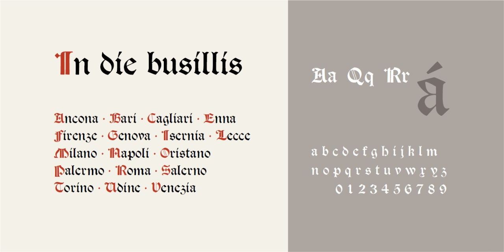
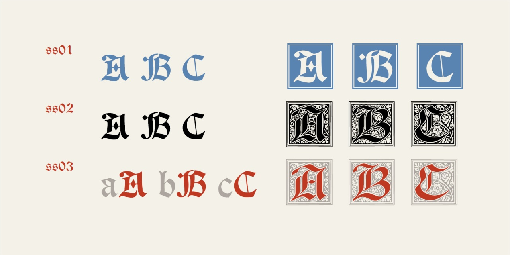

# In die busillis
* Versione 2.131: fix esportazione
* Versione 2.126: Sistemazione dei capolettera in modo da avere dimensioni ottimali
* Versione 2.102: Risistemazione del font e aggiunta dei [capolettera del XIX secolo in Petzendorfer](https://archive.org/details/schriftenatlasei00petz/page/n159/mode/2up) con possibilità di creare caratteri bicolori.
* Versione 1.1: versione iniziale

Per testare il font, vedere la [pagina interattiva](https://m-casanova.github.io/In-die-busillis/).

## Descrizione

Font basato su scansioni di [Tudor Black](https://fontsinuse.com/typefaces/40819/tudor-black]) del 1878 disegnato da E.P. Prince e F. Tarrant per Miller &amp; Richard.

Con la versione 2.102 sono inseriti anche capolettera aggiuntivi (anche a due colori).

