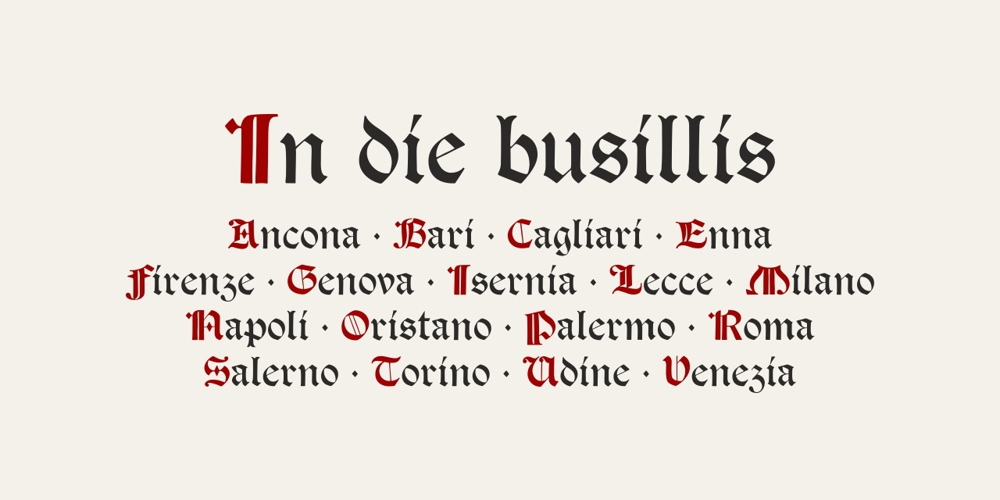

# In die busillis
Aggiornamento alla versione 1.1.

Font basato su scansioni di [Tudor Black](https://fontsinuse.com/typefaces/40819/tudor-black]) del 1878 disegnato da E.P. Prince e F. Tarrant per Miller &amp; Richard 

